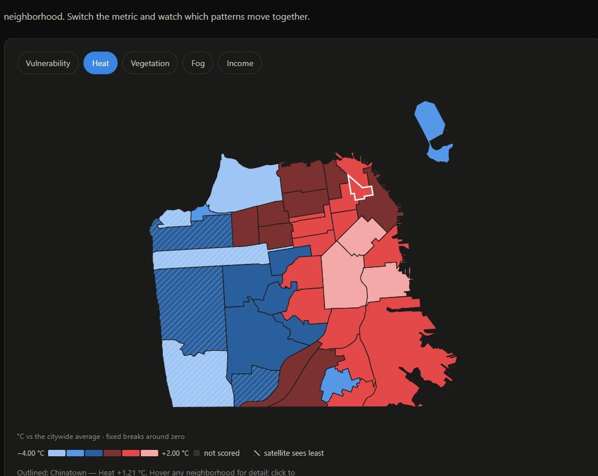
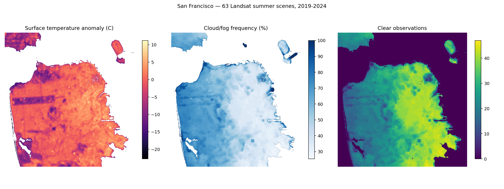

# The San Francisco Heat Index

Where heat concentrates across San Francisco's 41 neighborhoods, who is least equipped to cope
with it, and how far the underlying data can be trusted.

**The headline finding: San Francisco's heat map is drawn by fog, not by income.**

In most American cities surface temperature tracks poverty closely enough that heat maps and
income maps are near-substitutes. San Francisco breaks that pattern. Across its 41 analysis
neighborhoods, summer land surface temperature correlates with median household income at
**r = −0.11** — nothing. The marine layer overrules everything else, and it is handed out by
geography rather than by wealth.

But the shade people *build* is another story, and that is where the inequity lives.

🔗 **[Live dashboard](https://JacobColombo4729.github.io/CaliforniaHeatMapping/)**

[](https://JacobColombo4729.github.io/CaliforniaHeatMapping/)

*Cool on the ocean side, hot along the bay. Hatched neighborhoods are the ones the satellite
sees least — and they are the foggy ones, which is the central caveat of the whole project.*

---

## The finding

Computed over the 38 scored neighborhoods (three of the 41 are parks — see *Limitations*).

| Relationship | Pearson r | Spearman ρ |
|---|---|---|
| heat vs **fog** | **−0.79** | |
| heat vs **vegetation** | **−0.81** | |
| heat vs median income | −0.11 | −0.19 |
| fog vs median income | +0.15 | +0.17 |
| **vegetation vs median income** | **+0.40** | **+0.50** |
| **vegetation vs % below poverty** | **−0.36** | |
| **vulnerability index vs % below poverty** | **+0.61** | |

Three things follow.

**Fog and vegetation govern surface heat almost entirely**, at −0.79 and −0.81. Nothing else
comes close.

**Fog is equity-blind.** Its correlation with income is +0.15. It is a
physical accident of the coastline, and it is strong enough to flatten the heat-poverty
relationship that appears almost everywhere else. That is why the heat-versus-income scatter
on the dashboard is a flat cloud.

**Vegetation is not.** Greener neighborhoods are richer. The fog gradient is large enough to
bury this in raw temperature, but canopy is the part of the picture a city can actually
change — and it is distributed along economic lines.

The composite vulnerability index, which asks who can *cope* with heat rather than only who is
hot, ranks Chinatown, the Tenderloin, Japantown, South of Market and the Western Addition at
the top, and correlates +0.61 with the share of residents below poverty.

> Lakeshore ranks 37th of 38 despite 24.8% poverty, because it is among the foggiest and
> greenest places in the city. Exposure and disadvantage genuinely come apart here.

---

## How it works

Three scripts, run in order. Everything upstream exists to produce one file,
`data/neighborhoods.json`; the dashboard exists to display it. Nothing else crosses that line.

```
Landsat  ┐
ACS      ├──►  neighborhoods.json  ──►  docs/index.html
Canopy   ┘     41 features                one page, no dependencies
```

| Script | What it does |
|---|---|
| `pipeline/smoke_test.py` | Standalone check: reads one Landsat scene and plots it. Not part of the run. |
| `pipeline/boundaries_acs.py` | 41 neighborhood polygons + census demographics, aggregated from 241 tracts |
| `pipeline/landsat.py` | 63 summer scenes → surface temperature, fog frequency, NDVI, clear-observation counts |
| `pipeline/join_export.py` | Zonal statistics, the vulnerability index, and the exported artifact |



*The three rasters the pipeline produces. Note the third panel: the west side yields roughly
half the usable observations of the east, which is the clear-sky bias made visible.*

### The heat composite

One STAC query serves two products, which is why it deliberately does **not** filter on cloud
cover: clear pixels build the temperature composite, and the cloud masks discarded to make it
*are* the fog raster. A scene useless for temperature is a data point for fog.

Each scene is warped onto one canonical 30 m grid, normalized to its own citywide land mean,
and the stack reduced by median — so a regionally hot day cannot masquerade as a hot
neighborhood. Temperature is reported as an anomaly in °C against the city average.

### The vulnerability index

```
index = ( Exposure × Sensitivity × Capacity gap ) ^ (1/3)
```

Each component is the mean of its variables' percentile ranks among the 38 scored
neighborhoods, scaled 0–100. ↑ means a higher value raises vulnerability, ↓ that a lower one
does.

| Component | Variables |
|---|---|
| **Exposure** | heat anomaly ↑ · vegetation ↓ · fog ↓ |
| **Sensitivity** | aged 65+ ↑ · under 5 ↑ · below poverty ↑ |
| **Capacity gap** | median income ↓ · renters ↑ · limited-English households ↑ |

A *relative* position among these 38 neighborhoods, not an absolute risk — it does not transfer
to another city. All nine variables carry equal weight, and so do the three components. The
geometric mean means a neighborhood cannot fully offset extreme exposure with strong adaptive
capacity. Percentile ranks span (0, 1] and never reach zero, which would annihilate the product.

**Provenance.** Heat vulnerability indices are an established tool, and the
exposure / sensitivity / adaptive-capacity decomposition is the conventional
climate-vulnerability framing — neither is original here. **What is specific to this project is
the choice of these nine variables, weighting them all equally, weighting the three components
equally, and combining them geometrically.** Another analyst would reasonably choose differently
and get a different ranking.

**It has not been validated against any outcome.** A working index would be tested against
heat-related emergency visits or mortality. This one is tested against nothing — a defensible
composite of plausible variables, not a demonstrated predictor of harm.

**This project is race-agnostic.** No racial or ethnic variable is collected, computed or used
anywhere in it — not in the index, not in the models, not in the published data.

---

## The statistics

The dashboard reports 38 neighborhoods, which can only resolve correlations above |r| ≈ 0.32.
`pipeline/spatial_analysis.py` repeats the analysis over **232 census tracts**, where the floor
drops to 0.13, using methods that account for spatial dependence — because neighbouring tracts
are not independent observations, and ordinary least squares on spatial data produces standard
errors that are too small and p-values that are overconfident.

**What the larger sample changed.** The poverty rate resolves at r = +0.20 [+0.07, +0.32] —
poorer tracts really are hotter, which was invisible at n = 38. Median income still does not
resolve (r = −0.13 [−0.25, +0.00]); it is noisy and top-coded at $250k.

**What the spatial model shows.** Every variable is strongly clustered (fog I = +0.87, heat
I = +0.56, all p = 0.001). Lagrange Multiplier diagnostics select a spatial error model,
λ = 0.66, pseudo R² = 0.78. In it, **every demographic coefficient collapses to near zero**
while canopy and fog stay large. The poverty association is confounded by physical geography.

**Demographics alone explain 4% of the variance in heat** (R² = 0.040). That is the equity
finding in one number — and the reason it has to travel through something physical.

| Model | R² | Residual Moran's I |
|---|---|---|
| demographics only | 0.040 | +0.511 |
| + canopy | 0.414 | +0.642 |
| + fog | 0.768 | +0.465 |
| + terrain | 0.786 | +0.459 |
| + built-up | **0.801** | **+0.433** |

In the full specification (all variance inflation factors under 6, so nothing is too collinear
to read): built-up surface **+11.1** (p = 0.0001), fog **−10.6** (p < 0.0001), canopy **−4.0**
(p = 0.007), elevation +0.009/m and slope −0.11°, both p < 0.0001. Slope *aspect* is not
significant — at a late-morning overpass the sun is too high for orientation to matter.

### Mediation: the null was two opposing paths

`pipeline/mediation.py` tests income and poverty → canopy → heat, bootstrapping **blocks of
geography** rather than individual tracts — naive resampling assumes an independence this data
demonstrably lacks, and produces intervals that are far too narrow.

Intervals below are the spatial-block ones. Income shows **inconsistent mediation** — a real
mediated path cancelled by an opposing direct one, which is precisely why its raw correlation
looks like nothing. Poverty does not clear the bar.

| Path | Income (per $10k) | Poverty (per point) |
|---|---|---|
| a → canopy | +0.0036 [+0.0005, +0.0057] | −0.0017 [−0.0030, +0.0004] n.s. |
| b canopy → heat | −9.04 [−12.67, −5.68] | −8.44 [−12.50, −4.72] |
| **a×b indirect** | **−0.0323 [−0.0545, −0.0051]** | +0.0143 [−0.0038, +0.0285] n.s. |
| c′ direct | +0.0406 [+0.0066, +0.0716] | −0.0201 [−0.0375, +0.0037] n.s. |
| c total | +0.0083 (n.s.) | −0.0058 (n.s.) |

Money buys canopy and canopy cools — but income also raises heat directly, because wealthy San
Francisco holds its densest, most built-up ground, and the two nearly annul each other.

**Poverty does not produce a distinguishable mediated path.** Its indirect effect is significant
under naive resampling ([+0.0037, +0.0278]) and stops being so once blocks of geography are
resampled instead. That is exactly the kind of result the spatial bootstrap exists to catch, and
it is reported rather than taken from the naive run.

**The result hinges on one arguable choice.** Adding the built-up index to the controls makes
every path non-significant. NDBI and NDVI measure opposite sides of the same ground, so
conditioning on one while the other is the mediator blocks the path by construction rather than
by evidence — which is why the reported specification excludes it. Both are in
`data/mediation_results.json`; the conclusion reverses between them, so the choice is stated
rather than buried.

### Where a tree actually buys cooling

Every model above fits one canopy coefficient for the whole city, which assumes a tree in the
Sunset does the same work as a tree in the Mission. `pipeline/gwr.py` drops that assumption —
geographically weighted regression, adaptive bandwidth of 50 tracts chosen by AICc.

It is decisively better: **AICc improves by 233**, R² rises 0.753 → 0.938, local R² reaches
0.98, and 200 of 232 tracts show a significant canopy effect at the corrected alpha.

| Most cooling per 0.1 NDVI | | Least | |
|---|---|---|---|
| Outer Richmond (11 tracts) | **+1.68 °C** | Portola | +0.40 °C |
| Twin Peaks (2) | +1.61 °C | Bayview Hunters Point | +0.28 °C |
| Inner Sunset (6) | +1.60 °C | Financial District | +0.26 °C |
| Inner Richmond (5) | +1.60 °C | South of Market | +0.02 °C |

**Cooling power correlates +0.66 with fog** — trees buy *more* cooling where the marine layer
is already thickest. That is the opposite of the prediction, and it survives every check: local
VIF on canopy is 1.40 (canopy is separable from fog), the median local condition number of 30
turned out to be a units artefact that falls to 7.5 on standardised predictors, and restricting
to well-conditioned tracts alone the relationship still holds at +0.54.

The mechanism is **not** established here. Fog drip sustaining transpiration is plausible and
documented in coastal California, but range restriction also contributes — local cooling
correlates +0.43 with how much NDVI varies within a neighborhood.

> **The uncomfortable implication.** Tree planting buys the least cooling exactly where heat
> vulnerability is highest. South of Market, Bayview and the Financial District gain almost
> nothing per unit of added vegetation, while the already-cool, already-wealthy west gains
> 1.6–1.7 °C. This does not say don't plant trees in the Mission; it says trees alone will not
> close that gap, and cool roofs, less impervious surface and built shade probably matter more
> in the dense east.

**An honest negative result.** The point of adding terrain and built-up surface was to test
whether the right covariates would dissolve the residual spatial clustering. They did not:
+0.465 → +0.433, still p < 0.0001. Topography was not the missing variable, and the spatial
error term is still absorbing something unidentified — building height and density, albedo, or
anthropogenic heat are the remaining candidates. The spatial error model handles this correctly
for inference, but λ = 0.66 is not an explanation of anything.

## Data sources

| Layer | Source |
|---|---|
| Surface temperature, fog, NDVI | Landsat Collection 2 Level-2 via [Microsoft Planetary Computer](https://planetarycomputer.microsoft.com/) |
| Demographics | American Community Survey 2024 5-year via [Census Reporter](https://censusreporter.org/) |
| Neighborhood boundaries | [DataSF `j2bu-swwd`](https://data.sfgov.org/-/Analysis-Neighborhoods/j2bu-swwd) |
| Tract → neighborhood crosswalk | [DataSF `sevw-6tgi`](https://data.sfgov.org/Geographic-Locations-and-Boundaries/Analysis-Neighborhoods-2020-census-tracts-assigned/sevw-6tgi/about_data) |

Demographics come from Census Reporter's API rather than the Census Bureau's own endpoint.
It requires no API key and returns every needed table in one request. It is a third-party
wrapper around ACS, not an official endpoint — swapping back is a one-function change.

---

## Limitations

**Surface temperature is not air temperature.** Landsat measures the skin temperature of roofs
and pavement, which runs far hotter than the air a person stands in. The spatial pattern is
meaningful; absolute values are not comparable to a weather station.

**Daytime only.** Landsat passes late morning. Night-time heat retention is the more
health-relevant variable and is not measured here.

**Clear-sky bias — the important one, and it is measured rather than asserted.** A thermal
sensor cannot see through fog, so the foggiest neighborhoods are observed almost exclusively on
their rare clear days, which are their warm days. Usable observations run from **14 to 41** of
63 scenes.

The pipeline quantifies the distortion directly: for every pixel it computes the average
citywide temperature on the days that pixel was visible, minus the average across all scenes.
**Every neighborhood comes out biased warm, from +0.43 °C to +1.25 °C, and the bias correlates
r = +0.58 with fog** — the foggier the place, the more its coolness is hidden. Lakeshore, the
foggiest scored neighborhood, is seen on 14 of 63 scenes with a +1.25 °C bias.

So every temperature number here understates how much cooler the west really is, which makes
the canopy inequity a floor rather than a ceiling. The dashboard hatches the affected
neighborhoods, maps the bias, and grades every neighborhood's measurement confidence.

Worth stating explicitly: **this bias does not manufacture the headline null result.** Sampling
bias correlates only weakly with income, and in the direction that would make the heat–income
relationship *more* negative if corrected — not closer to zero.

**Census estimates carry margins, and they are propagated.** Margins of error are combined in
quadrature across tracts and through the ratio formula, giving each neighborhood a coefficient
of variation. Against the Census Bureau's own thresholds, 28 of 38 scored neighborhoods are
reliable, 8 warrant caution and 2 are unreliable. Per-variable margins are in the data table.

**Three neighborhoods are parks.** Golden Gate Park (58 residents), McLaren Park (146) and
Lincoln Park (160, and zero households) produce census rates that are pure noise — McLaren Park
reads 75% poverty off ~115 households. They are mapped but never scored or ranked.

**Neighborhood median income is an approximation.** Medians cannot be summed, so it is a
household-weighted mean of tract medians. Every other rate is exact: summed numerator over
summed denominator, which is what population weighting actually means.

**41 units is coarse.** Real inequity exists within neighborhoods and is invisible here.

**The Farallon Islands are excluded.** Legally San Francisco County, 30 km offshore, and absent
from the city's own boundary file.

---

## Reproduce

```bash
conda env create -f environment.yml
conda activate sfheat
python -m pip install --force-reinstall --no-deps rasterio rioxarray pyogrio pyarrow

python pipeline/boundaries_acs.py   # ~30 s
python pipeline/landsat.py          # ~15 min first run, then cached
python pipeline/join_export.py      # ~5 s
```

See `environment.yml` for why four packages come from pip. No API keys are required.

The dashboard states the findings once, at the top, and then hands over the apparatus: any of
29 variables on the map, any pair on a scatter, a clickable correlation matrix across every
variable, the fitted spatial / mediation / GWR output, and the full table as sortable columns or
a CSV download. The conclusions are the short list; everything below them is for checking them.

It is a single static HTML file with no build step and no dependencies — maps and charts are
inline SVG. Open `docs/index.html` directly, or serve the folder:

```bash
python -m http.server 8765 --directory docs
```

`PROJECT_PLAN.md` carries the full decision log, including what was cut and why.
